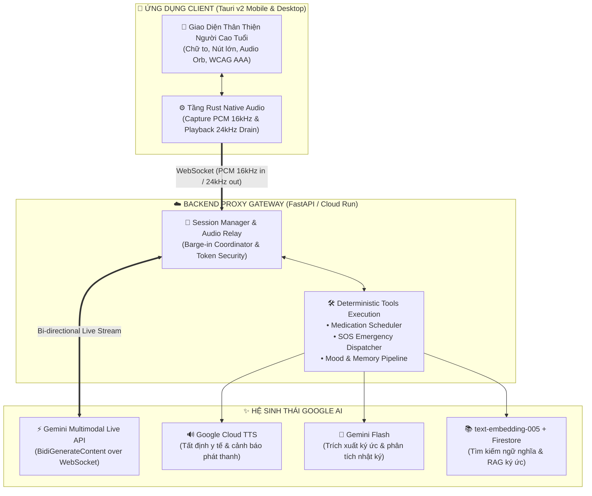

<div align="center">

# 🌿 AN NHIÊN (AnNien)
### *Người Bạn Đồng Hành & Trợ Lý Đàm Thoại Thời Gian Thực Dành Riêng Cho Người Cao Tuổi*

[](https://ai.google.dev/)
[](https://tauri.app/)
[](https://fastapi.tiangolo.com/)
[](https://cloud.google.com/text-to-speech)
[](https://github.com)

<p align="center">
  <b>Đàm thoại hai chiều siêu tốc</b> • 
  <b>Barge-in ngắt lời tự nhiên</b> • 
  <b>Nhắc thuốc y tế tất định</b> • 
  <b>Cảnh báo khẩn cấp SOS</b> • 
  <b>Giao diện tương phản cao trợ năng</b>
</p>

---

</div>

## 🌟 1. Bối Cảnh & Tầm Nhìn Dự Án

Bước vào thời đại số, công nghệ phát triển như vũ bão nhưng phần lớn ứng dụng hiện đại lại vô tình tạo ra rào cản đối với thế hệ ông bà, cha mẹ:
- **Thị lực & thính lực suy giảm**: Khó đọc những dòng chữ nhỏ, khó phân biệt các biểu tượng phức tạp.
- **Rào cản thao tác chạm**: Bàn tay run, phản xạ chậm khiến việc gõ phím ảo hay điều hướng menu nhiều tầng trở nên căng thẳng.
- **Sự cô đơn lúc tuổi già**: Con cháu bận rộn với công việc hoặc sống xa nhà, người cao tuổi thiếu đi người lắng nghe, chia sẻ tâm tư mỗi ngày.
- **An toàn sức khỏe**: Nguy cơ quên lịch uống thuốc, nhầm lẫn liều lượng hay các tình huống té ngã, đau ốm bất chợt khi ở nhà một mình.

> ### 💡 Sứ Mệnh Của An Nhiên
> **An Nhiên** ra đời với sứ mệnh biến chiếc điện thoại thông minh trở thành **người cháu nhỏ hiếu thảo trong gia đình** — luôn túc trực bên cạnh các cụ 24/7, lắng nghe bằng cả tấm lòng, chuyện trò thân tình bằng giọng nói tiếng Việt tự nhiên và chăm lo chu đáo cho từng cữ thuốc, giấc ngủ của ông bà.

---

## 👵 2. Trải Nghiệm Thiết Kế Dành Riêng Cho Người Cao Tuổi

Mọi chi tiết trong An Nhiên đều được tinh chỉnh dựa trên tiêu chuẩn trợ năng quốc tế (**WCAG AAA**) và tâm lý học tiếp nhận của người lớn tuổi:

| Yếu Tố Thiết Kế | Trải Nghiệm Trên An Nhiên |
| :--- | :--- |
| **🔤 Kiểu Chữ & Kích Thước** | Hệ thống chữ siêu lớn (*24px – 36px*), nét đậm, phông chữ không chân rõ ràng, dễ đọc ngay cả khi không đeo kính lão. |
| **🎨 Tương Phản & Màu Sắc** | Tông màu be dịu mắt (*Stone / Sand*) kết hợp xanh ngọc bích (*Teal*) và điểm nhấn cứu hộ đỏ cam (*Amber / Rose*), độ tương phản cao giúp chống mỏi mắt. |
| **🔘 Nút Bấm Xúc Giác Lớn** | Các nút bấm vật lý ảo có kích thước cực đại, phản hồi trạng thái rõ ràng, hỗ trợ chạm dễ dàng mà không sợ trượt tay. |
| **🔮 Quả Cầu Âm Thanh (Audio Orb)** | Hiệu ứng thị giác trực quan chuyển động theo nhịp thở và biên độ giọng nói, giúp cụ biết rõ khi nào trợ lý đang lắng nghe hoặc đang trả lời. |
| **🚫 Tối Giản Tuyệt Đối** | Không quảng cáo, không banner gây rối, không menu phụ ẩn giấu — mở ứng dụng là có thể bắt đầu trò chuyện ngay lập tức. |

---

## ✨ 3. Hệ Tính Năng Cốt Lõi

```
                           ┌─────────────────────────────────────────┐
                           │            AN NHIÊN ECOSYSTEM           │
                           └────────────────────┬────────────────────┘
                                                │
         ┌──────────────────────┬───────────────┴──────────────┬──────────────────────┐
         ▼                      ▼                              ▼                      ▼
┌──────────────────┐  ┌──────────────────┐           ┌──────────────────┐  ┌──────────────────┐
│  ĐÀM THOẠI LIVE  │  │  NHẮC THUỐC ĐỊNH  │           │   CẢNH BÁO SOS   │  │ TRÍCH XUẤT KÝ ỨC │
│  Hai chiều < 1s  │  │  TTS chuẩn y khoa │           │   Cấp cứu 1-chạm │  │  Nhật ký an sinh │
│  Barge-in tự do  │  │  Không ảo giác    │           │   Bảo vệ 24/7    │  │  Thấu hiểu cụ   │
└──────────────────┘  └──────────────────┘           └──────────────────┘  └──────────────────┘
```

### 🎙️ 1. Đàm Thoại Trực Tiếp Thời Gian Thực (Real-time Conversational Voice)
- **Tốc độ phản hồi cực nhanh**: Nhờ sức mạnh của **Gemini Multimodal Live API**, cuộc trò chuyện diễn ra tự nhiên với độ trễ phản hồi dưới 1 giây, hệt như đang nói chuyện trực tiếp cùng người thân.
- **Barge-In tự nhiên (Ngắt lời tức thì)**: Khi AI đang phát âm thanh, nếu cụ cất tiếng ngắt lời ("Khoan đã cháu", "Để bác nói nốt"), hệ thống lập tức ngắt tiếng của AI và chuyển sang chế độ chú ý lắng nghe, không bắt cụ phải đợi AI nói hết câu.
- **Xưng hô thân mật, chuẩn mực văn hóa**: AI tự động thích ứng với vai vế được gia đình thiết lập (gọi là *Bác An*, *Cụ An*, xưng là *Cháu Út*, *An Nhiên*), thấu hiểu phương ngữ và cách nói chuyện chậm rãi, tình cảm của người già.

---

### 💊 2. Quản Lý & Nhắc Nhở Uống Thuốc Tất Định (Deterministic Medical Safety)
- **Cơ chế lai (Hybrid Architecture) loại bỏ Hallucination**:
  - Gemini Live xử lý giao tiếp tự nhiên và xác định thời điểm uống thuốc.
  - **Google Cloud Text-to-Speech (Neural2 / Wavenet)** chịu trách nhiệm phát âm chính xác tuyệt đối tên thuốc, liều lượng (ví dụ: *Amlodipine 5mg, uống 1 viên sau ăn sáng*) bằng giọng đọc chuẩn y tế, ngăn ngừa triệt để tình trạng AI suy diễn sai lệch đơn thuốc.
- **Sổ tay nhắc thuốc to bản**: Màn hình hiển thị danh sách thuốc trong ngày rõ ràng, cho phép cụ đánh dấu *"Đã uống"* bằng giọng nói hoặc thao tác một chạm.

---

### 🚨 3. Kích Hoạt Cảnh Báo Khẩn Cấp SOS Một Chạm
- **Nhận diện giọng nói khẩn cấp**: Cụ chỉ cần nói những câu như *"Cứu bác với"*, *"Tôi bị chóng mặt quá"*, *"Cháu ơi bác bị ngã"* — trợ lý sẽ lập tức nhận diện nguy cấp và kích hoạt quy trình SOS.
- **Nút bấm SOS độc lập**: Phím bấm khẩn cấp màu đỏ nổi bật luôn thường trực trên màn hình chính.
- **Cơ chế an toàn có thời gian đếm ngược**: Hạn chế báo động giả khi bấm nhầm, đồng thời tự động phát thanh hướng dẫn cụ ngồi yên giữ bình tĩnh và chuyển thông báo tức thì đến điện thoại con cháu.

---

### 🧠 4. Trích Xuất Ký Ức & Nhật Ký An Sinh (Memory & Well-being)
- **Thấu hiểu tâm sự**: Tự động nhận diện cảm xúc (vui vẻ, phấn khởi, buồn bã, lo âu, mệt mỏi) qua từng phiên trò chuyện để lập biểu đồ an sinh tinh thần.
- **Kho kỷ niệm gia đình**: Trích xuất những hồi ức thời trẻ, kỷ niệm quê hương, sở thích ăn uống hay thói quen sinh hoạt để làm phong phú ngữ cảnh đàm thoại, giúp trợ lý càng trò chuyện lâu càng trở nên thân thiết, gắn bó.

---

### 👨‍👩‍👧‍👦 5. Cổng Quản Trị Gia Đình Đa Nền Tảng (Caregiver Portal)
Hệ sinh thái An Nhiên vận hành theo mô hình **2 trong 1**:
- **Dành cho Người Cao Tuổi**: Ứng dụng Android APK chuyên dụng, tối ưu hóa cho màn hình điện thoại hoặc máy tính bảng đặt ở phòng khách/đầu giường.
- **Dành cho Con Cháu (Caregiver Dashboard)**: Cổng Web quản trị truy cập linh hoạt từ trình duyệt:
  - Thiết lập hồ sơ sức khỏe và giờ uống thuốc của cụ.
  - Theo dõi nhật ký trò chuyện, các cảnh báo SOS và biến động tâm trạng hàng tuần.
  - Tải nhanh bản cài đặt APK mới nhất cho điện thoại của cha mẹ.

---

## 🏗️ 4. Kiến Trúc Hệ Thống Tổng Thể



---

## 💻 5. Bảng Công Nghệ Chủ Đạo

| Thành Phần | Công Nghệ Sử Dụng | Vai Trò & Điểm Nổi Bật |
| :--- | :--- | :--- |
| **Trò chuyện Trực tiếp** | `Gemini Multimodal Live API` | Đàm thoại hai chiều thời gian thực với độ trễ cực thấp, nhận thức giọng nói và cảm xúc tự nhiên. |
| **Xử lý Tác vụ Y tế** | `Google Cloud Text-to-Speech` | Giọng đọc chuẩn tiếng Việt (*Wavenet/Neural2*) cho các thông tin thuốc và cảnh báo khẩn cấp, loại bỏ sai lệch y khoa. |
| **Trích xuất Tri thức** | `Gemini Flash & Embeddings` | Khai phá ký ức hồi tưởng và phân tích nhật ký an sinh của người cao tuổi sau mỗi phiên trò chuyện. |
| **Ứng dụng Phía Cụ** | `Tauri v2 (Rust + React + TS)` | Tối ưu hóa hiệu năng native, dung lượng file cài đặt siêu nhẹ (~40MB), chạy mượt mà trên các dòng máy Android phổ thông. |
| **Cổng Điều Phối** | `FastAPI (Python) + WebSockets` | Quản lý phiên đàm thoại tập trung, giữ an toàn tuyệt đối cho API Key và điều phối luồng âm thanh hai chiều. |
| **Hạ Tầng Điện Toán** | `Google Cloud Run` | Triển khai tại trung tâm dữ liệu Đông Nam Á (`asia-southeast1`), hỗ trợ WebSocket duy trì liên tục và tự động co giãn. |

---

## 💖 6. Giá Trị Xã Hội & Ý Nghĩa Nhân Văn

An Nhiên không chỉ đơn thuần là một sản phẩm công nghệ; đó là chiếc cầu nối tình thân giữa các thế hệ trong gia đình Việt:
- **Giảm bớt sự cô đơn**: Mang lại tiếng cười và sự an ủi tinh thần cho những cụ già neo đơn hoặc phải ở nhà một mình cả ngày.
- **An tâm cho con cháu**: Giúp những người con, người cháu đang bận rộn công tác phương xa có thể yên tâm rằng cha mẹ luôn có một người bạn đồng hành tận tụy và an toàn sức khỏe luôn được trông nom cẩn thận.
- **Thu hẹp khoảng cách số**: Đưa những tiến bộ trí tuệ nhân tạo hiện đại nhất phục vụ trực tiếp cho nhóm người dễ bị tổn thương nhất trong xã hội theo cách giản dị, dễ gần nhất.

---

<div align="center">

**An Nhiên — Ấm áp từng cuộc trò chuyện, an lòng mỗi phút giây tuổi già.**  
*Một dự án công nghệ phụng sự cộng đồng và gia đình Việt Nam.*

</div>
